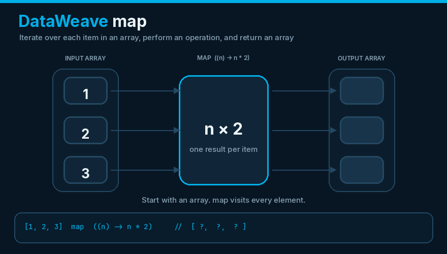
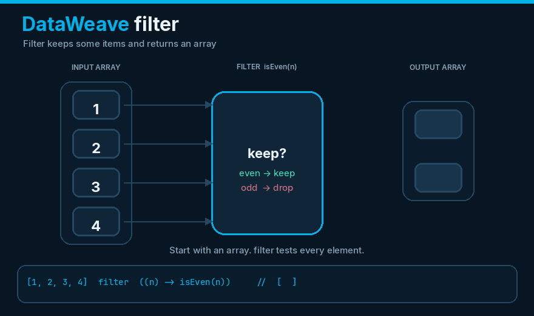

# DataWeave 2

**Files:** `src/main/resources/modules/*.dwl` and `<ee:transform>` CDATA in XML

## What it is

Mule’s transformation language. Prefer **modules on the classpath** (`import * from modules::portal`) for reusable rules; keep flow transforms thin.

## `map` — transform every item, return an array

`map` walks each element of an array, applies an expression, and **returns a new array of the same length**. It does not change the original collection.



```dataweave
%dw 2.0
output application/json
---
[1, 2, 3] map ((n) -> n * 2)
// [2, 4, 6]
```

The lambda can also use `(item, index) -> …` when you need the position.

## `filter` — keep some items, return an array

`filter` tests each element with a predicate. Items that pass are **kept**; the rest are dropped. The result is a **new array**, often shorter than the input.



```dataweave
%dw 2.0
output application/json
---
[1, 2, 3, 4] filter ((n) -> isEven(n))
// [2, 4]
```

Unlike `map`, length is not preserved — only matching items appear in the output.

## Modules in this repo

| Module | Apps | Purpose |
|---|---|---|
| `errors.dwl` | all | Canonical error JSON + HTTP mapping |
| `headers.dwl` | all | Correlation + outbound headers |
| `fulfillment.dwl` | process | Credit and status functions (MUnit covered) |
| `portal.dwl` | experience | UX labels and stock health (MUnit covered) |

## Tips

- `output application/java` for variables you will store in Object Store or reuse in connectors
- `output application/json` only at the HTTP boundary
- `p('app.name')` reads properties
- Avoid `write(payload, "application/json")` unless you must; typed objects are cheaper

MUnit in this project tests DataWeave **without** spinning HTTP, which is the fastest way to lock business rules.
